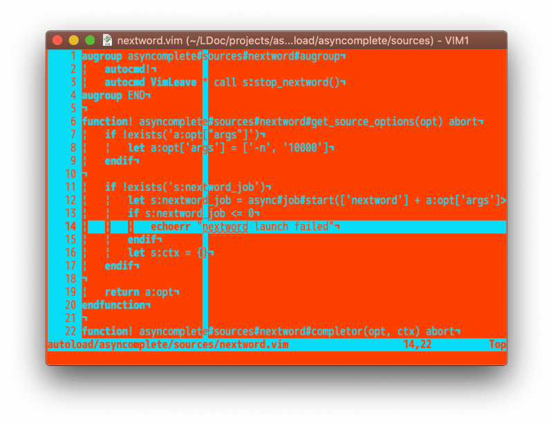

# gaming.vim
Gaming Vim color scheme.



## Requirements

- Vim (not Neovim)
- +timer
- True color terminal or GVim

## Installing

```
Plug 'high-moctane/gaming.vim'

colorscheme gaming
```

## Customization

These parameters must be set before calling `colorscheme gaming`.

```vim
" 500 milliseconds colors cycle
let g:gaming#period = 500

" Updating colors every 50 milliseconds
let g:gaming#update_time = 50
```

## LICENSE

MIT
